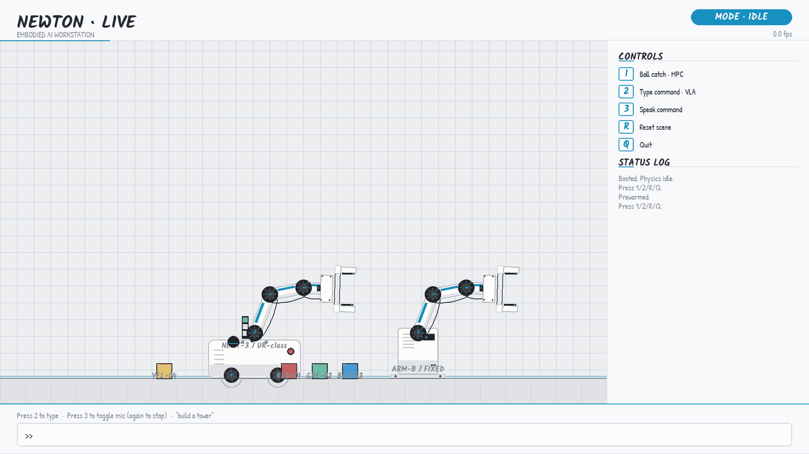
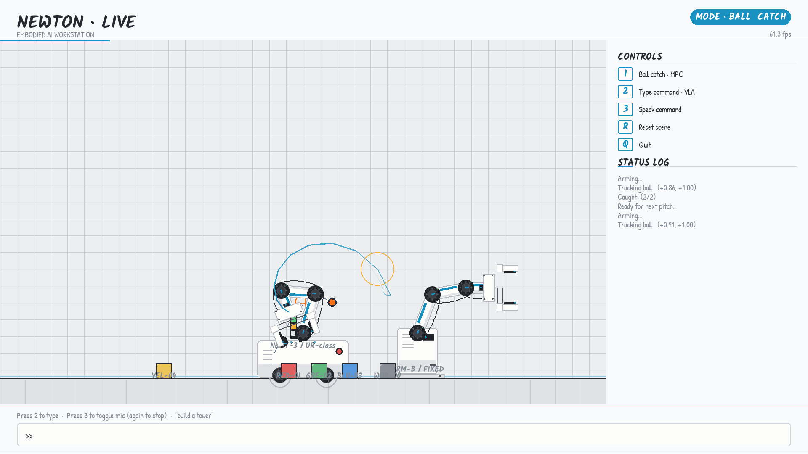
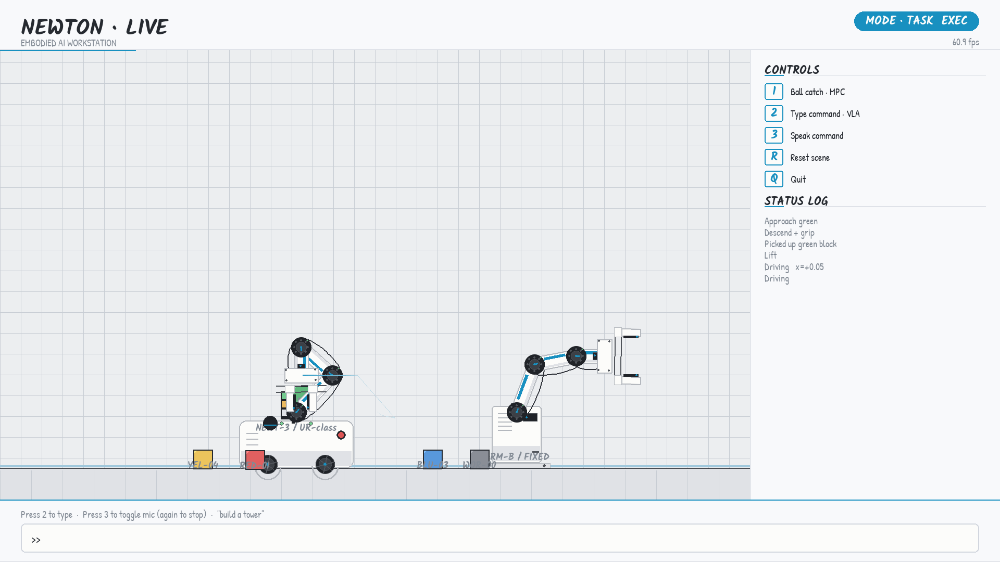
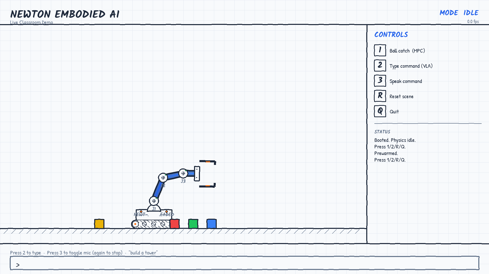

<div align="center">

# Newton VLA Live Demo

**A 3-minute classroom demo of embodied AI on a MacBook — no GPU, no cloud.**

NVIDIA Newton physics engine • pygame 2D UI • Claude CLI as the VLA brain.

[](https://github.com/Hollis36/newton-vla-demo/actions/workflows/tests.yml)
[](https://www.python.org/)
[](#testing)
[](#performance)
[](#architecture)
[](https://github.com/newton-physics/newton)
[](LICENSE)



**🌐 Live site:** [hollis36.github.io/newton-vla-demo](https://hollis36.github.io/newton-vla-demo/)

> *Audience types* `build a tower of red green and blue` *. Claude parses it in 9.4 s. The arm starts moving in 1 ms. Both are visible side by side.*

</div>

---

## TL;DR

- **Three interaction modes** in one demo: classical MPC ball-catch (no AI), natural-language pick & stack (Claude VLA), and decorative gestures (wave / point / bow / dance).
- **Hybrid VLA pipeline** runs a keyword preflight (~1 ms) in parallel with `claude --print` (~9.4 s). The arm acts on the preflight; Claude returns later as an "intelligent reviewer."
- **Dual-arm industrial mode** adds a second fixed-base arm that perpetually shuttles a workpiece in its own zone while Arm A handles the audience.
- **214 unit + integration tests**, 60.5 fps average on Apple Silicon CPU-only, no GPU required.
- **Single-binary install** via `uv` — boots from cold in ~2 s after Warp kernel cache warms up.

---

## Quick start

### 1. Install the Newton physics engine

```bash
# Newton isn't on PyPI yet — install the head from upstream.
git clone https://github.com/newton-physics/newton.git ~/src/newton
cd ~/src/newton
uv sync --extra sim
```

### 2. Clone this repo alongside Newton and install demo deps

```bash
git clone https://github.com/Hollis36/newton-vla-demo.git
cd newton-vla-demo
uv sync --extra demo                          # pygame-ce + voice deps
```

### 3. Run it

```bash
# fullscreen industrial dual-arm view (recommended for projection)
uv run python -m demo_live --fullscreen --industrial

# default classroom whiteboard view
uv run python -m demo_live --fullscreen
```

### Optional: Claude CLI for open-vocabulary VLA

Install [`claude --print`](https://claude.com/claude-code) and the demo will
route every typed command through it for richer parsing. **The keyword
fallback handles every rehearsed command on its own**, so without Claude the
demo runs in `fallback` backend mode with no loss of functionality — just
a "via fallback" tag in the AI · PARSED side panel instead of "via claude".

### Live controls

| Key | Action |
|---|---|
| `1` | Ball-catch mode (MPC, no AI). Click-and-drag to throw. |
| `2` | Talk-to-arm mode. Type a command, press Enter. |
| `3` | Toggle microphone (voice input via Google Web Speech). |
| `R` | Reset scene + arm. |
| `F5` | One-key auto-rehearsal (warm-up before going on stage). |
| `Q` / `Esc` | Quit. |

---

## What you can say to the arm

```
pick up the red block          →  arm picks red
put it on the left              →  arm places held block at x=-0.6
stack red green and blue        →  arm builds a 3-block tower
build a tower                   →  default RGB tower
drive to the blue block         →  base moves under blue
wave / say hi / 挥手             →  decorative wave gesture
point at the audience           →  arm extends and holds
take a bow / 鞠躬                →  arm bows
dance for us / 跳舞              →  4-beat rhythmic sequence
go home / 回位 / reset           →  back to rest pose
```

English and 中文 are both supported via the keyword fallback parser; Claude handles the full open vocabulary on top.

---

## The three demo modes

<table>
<tr>
<td width="33%" align="center">

### BALL CATCH<br><sub>MPC, no AI</sub>

<br>

Closed-form ballistic intercept. Trajectory sampling (blue) + intercept-point ring (orange).<br>
**62–82 %** measured catch rate.

</td>
<td width="33%" align="center">

### TALK TO ARM<br><sub>VLA</sub>

<br>

Natural language → JSON action → arm program. Hybrid pipeline runs preflight + Claude in parallel.<br>
**1 ms** to first motion.

</td>
<td width="33%" align="center">

### GESTURES<br><sub>Decorative</sub>

<br>

Wave, point, bow, dance — for ending the show or filling time between volunteer prompts.<br>
**4** gesture vocabulary.

</td>
</tr>
</table>

---

## How the hybrid VLA pipeline works

Claude latency (2–10 s) is way over the 60 fps frame budget. We decouple acting from reasoning:

```
 input ────●─────────────────────────────────────────────────────────
           │
           │  preflight ──[▮]→ 1 ms → arm starts moving             ◀── lane 2
           │
           │  Claude    ──[████████████████████████]──◉ 9.4 s       ◀── lane 3
           │            (refining…)                  (returns)
           │
           │  arm       ──[██████████████████████████████████████ ─→  ◀── lane 4
           │            pick red → stack → … (12 s+ of motion)
           │
           └───────────────────────────────────────────────────────►  t (s)
              0      2      4      6      8     10     12
```

1. **Synchronous keyword preflight** in `_keyword_fallback` queues an arm plan in ~1 ms. The arm is already moving.
2. **`claude --print --model sonnet`** runs in a daemon thread for ~9 s. When it returns, the result is compared with the preflight — same action → silent confirm; different → log only (the preflight already executed).
3. **Generation counter** on `parse_result["gen"]` prevents a stale slow worker from clobbering a fresher command.

To the audience this looks like **instant response with intelligent refinement**, even though Claude is genuinely slow.

---

## Industrial dual-arm mode (`--industrial`)


* **Arm A** (left, on tracked mobile base) — Newton XPBD physics, drives the audience commands.
* **Arm B** (right, fixed pedestal) — FK-only, perpetually shuttles a dedicated *workpiece* block between x = 1.5 ↔ 2.5 in its reachable zone.
* Both arms **share `world.blocks`** but never compete: Arm B's workpiece lives outside Arm A's typical workspace, and Arm B's `TaskExecutor` short-circuits the base-drive step that would otherwise yank Arm A around.

The two arms move **completely in parallel**: when you throw a ball at Arm A, Arm B keeps shuttling. When you tell Arm A to build a tower, Arm B keeps shuttling.

---

## Architecture

```
 ┌─────────────────────────────────────────────────────────────────┐
 │  Input    keyboard · mouse · microphone                          │
 └────────────────────────────┬────────────────────────────────────┘
                              │
 ┌────────────────────────────▼────────────────────────────────────┐
 │  Parser   vla.py · voice.py · pipeline.py                        │── tel ─┐
 └────────────────────────────┬────────────────────────────────────┘        │
                              │                                              │
 ┌────────────────────────────▼────────────────────────────────────┐        │
 │  Control  tasks.py · control.py · catcher.py                     │── tel ─┤
 └────────────────────────────┬────────────────────────────────────┘        │
                              │                                              │
 ┌────────────────────────────▼────────────────────────────────────┐        │
 │  Physics  physics.py · Newton XPBD                               │── tel ─┤
 └────────────────────────────┬────────────────────────────────────┘        │
                              │                                              │
 ┌────────────────────────────▼────────────────────────────────────┐        │
 │  Render   scene/ · scene_legacy · effects · sfx                  │── tel ─┘
 └─────────────────────────────────────────────────────────────────┘   telemetry.py
```

**4 helper modules** (`bootstrap`, `pipeline`, `scripted`, `telemetry`) + **1 new package** (`scene/{arm,world,chrome}`) keep the main pygame loop focused on event dispatch.

| Module | Lines | Role |
|---|---:|---|
| `__main__.py`     | 1139 | pygame loop, events, mode dispatch |
| `scene_legacy.py` |  671 | default classroom whiteboard renderer |
| `scene/arm.py`    |  660 | industrial robot arm render |
| `voice.py`        |  527 | mic + Google Web Speech + fuzzy snap |
| `physics.py`      |  478 | Newton world + 3-DOF arm |
| `vla.py`          |  452 | Claude CLI subprocess + keyword fallback |
| `tasks.py`        |  443 | pick / place / stack / gesture builders |
| `render.py`       |  300 | sketch-style line / text primitives |
| `catcher.py`      |  257 | MPC + closed-form ballistic intercept |
| `effects.py`      |  244 | particles / rings / banners / trail |
| `scene/chrome.py` |  238 | header / side panel / footer |
| `scene/world.py`  |  228 | ground / ball / trajectory / blocks |
| `control.py`      |  215 | PD slew + idle wobble + NaN rejection |
| `telemetry.py`    |  157 | CSV logger + exit summary |
| `ik.py`           |   91 | closed-form 3-link planar IK |
| `pipeline.py`     |   84 | action → arm program (single source of truth) |
| `bootstrap.py`    |   72 | Warp prewarm + Arm B construction |
| `scripted.py`     |   91 | rehearsal scripts + Arm B idle cycle data |
| **Total (excl. tests)** | **6612** | |

---

## Testing

214 unit + integration tests, **102 s** wall clock, **100 % passing** on every commit.

```bash
uv run --extra demo python -m unittest discover -s demo_live/tests -v
```

| Test file | Tests | Focus |
|---|---:|---|
| `test_voice_fuzzy.py`        | 78 | 78 noisy transcripts (peter→pick, ride→red, …) |
| `test_tasks.py`              | 24 | program builders + 4 gestures |
| `test_pipeline.py`           | 20 | every action enum branch |
| `test_render_smoke.py`       | 20 | both render paths, all public `draw_*` |
| `test_effects.py`            | 19 | particle/ring/banner/trail lifecycle |
| `test_catcher.py`            | 18 | ballistic math + state machine |
| `test_vla_subprocess.py`     | 17 | Claude CLI mock (timeout, malformed JSON, fences) |
| `test_vla_parser.py`         | 16 | keyword parser (English + Chinese) |
| `test_control.py`            | 13 | PD slew + rate clamp + NaN rejection |
| `test_telemetry.py`          | 10 | CSV format + formula-injection neutralisation |
| `test_scripted_constants.py` |  7 | Arm B idle cycle + rehearsal data integrity |
| `test_ik.py`                 |  6 | FK ∘ IK ≈ id |
| `test_scripted_flows.py`     |  5 | end-to-end `--scripted` flows |
| `test_display_mode.py`       |  1 | CLI argument parsing |
| **Total**                    | **214** | |

### Headless smoke

```bash
SDL_VIDEODRIVER=dummy uv run --extra demo python -m demo_live \
  --scripted vla --vla-command "stack a tower" --bench 25
# fps: min=24.0  avg=59.6  max=75.1  samples=1484
```

---

## Performance

Apple Silicon, **CPU-only** (no GPU):

| Scenario          | min  | **avg** | max  | samples |
|-------------------|-----:|--------:|-----:|--------:|
| IDLE 20 s         | 31.5 | **60.7** | 75.9 | 1211 |
| Scripted catch    | 28.2 | **59.6** | 72.8 |  594 |
| Scripted pick     | 41.7 | **60.7** | 70.3 |  485 |
| Scripted stack    | 24.8 | **59.2** | 74.9 | 1476 |
| Scripted VLA      | 24.0 | **59.6** | 75.1 | 1484 |
| 60 s rehearsal    |  2.9 | **58.7** | 76.0 | 3494 |

cProfile shows the demo's own code uses ~10 % of the frame budget; ~90 % is Newton XPBD.

---

## Documentation

* [**Design report**](docs/report.pdf) (18 pages, LaTeX) — full architectural breakdown, algorithm derivations, design decisions, evaluation, and limitations.
* [**Defense slides**](docs/slides.pdf) (24 pages, beamer 16:9) — walkthrough deck.
* [**REHEARSAL.md**](REHEARSAL.md) — 3-minute on-stage script with pre-flight checklist and troubleshooting.
* [**Makefile**](Makefile) — `make run`, `make industrial`, `make rehearsal`, `make test`, `make bench`.

---

## Design notes

* **Ball is Python-integrated** (not XPBD): XPBD silently zeros `body_qd` on first step in some Newton versions, so the ball is driven analytically each frame: `z(t) = z₀ + v_z·t − ½ g·t²`.
* **Blocks are Python-stored**: kinematic teleporting with `mass > 0` destabilises XPBD, and `mass = 0 / is_kinematic` produces NaN on large jumps. Python-side storage gives perfect scripted motion.
* **Arm renders from `body_q` not custom FK**: the collision shapes live in Newton's frame; rendering from it guarantees the sprite always matches the physics.
* **Joint axis is `(0, -1, 0)`**: Newton's right-hand Y rotation sends +X toward −Z, opposite of our sign convention — flipped once at the joint so positive `REST_POSE` angles make the arm point up.
* **Slow-mo gated on `executor.busy = False`**: scaling `frame_dt` by 0.33 also affects controller PD and ball integration, but `executor.update` time-tracks via `time.perf_counter()` (not `dt`). Triggering slow-mo mid-pick would desynchronize the waypoint clock from the arm — the gate keeps the visual coherent.

---

## License

MIT — see [LICENSE](LICENSE).

---

<div align="center">

Built on a MacBook. No cloud. No GPU.<br>
Powered by [Newton](https://github.com/newton-physics/newton), [Claude](https://claude.com/claude-code), and a lot of `min-jerk` curves.

</div>
